# Zero-Hallucination Protocol - Decision Flow

```mermaid
flowchart TD
    Start([Request Received]) --> PreFlight{Pre-Flight Check<br/>8 Validations}
    
    PreFlight -->|1. Files Known?| PF1{Target Accessible?}
    PF1 -->|No| Stop1[Stop: Request File Info]
    PF1 -->|Yes| PF2{2. Operation Defined?}
    
    PF2 -->|No| Stop2[Stop: Clarify Operation]
    PF2 -->|Yes| PF3{3. Inputs/Outputs<br/>Identified?}
    
    PF3 -->|No| Stop3[Stop: Specify I/O]
    PF3 -->|Yes| PF4{4. Dependencies &<br/>Side Effects Known?}
    
    PF4 -->|No| Stop4[Stop: Map Dependencies]
    PF4 -->|Yes| PF5{5. Similar Logic<br/>Searched?}
    
    PF5 -->|No| SearchCode[Search Codebase]
    SearchCode --> PF6{6. Execution Mode<br/>Determined?}
    PF5 -->|Yes| PF6
    
    PF6 -->|No| Stop5[Stop: Clarify Mode]
    PF6 -->|Yes| ModeCheck{Execution Mode?}
    
    ModeCheck -->|READ_ONLY| ReadOnlyMode[Analysis Only<br/>No Code Generation]
    ReadOnlyMode --> ProvideAnalysis[Provide Explanation/Review]
    ProvideAnalysis --> ReflectionCheck
    
    ModeCheck -->|PIPELINE| PF7{7. Size/Complexity<br/>Measured?}
    ModeCheck -->|LEGACY| LegacyMode[Legacy Protection<br/>Active]
    
    PF7 -->|No| Stop6[Stop: Measure Complexity]
    PF7 -->|Yes| PF8{8. Confidence<br/>Evaluated?}
    
    PF8 -->|No| Stop7[Stop: Assess Confidence]
    PF8 -->|Yes| CheckRisk{Assess Risk Level}
    
    CheckRisk -->|Critical| Critical[Confidence ≥ 70%?]
    CheckRisk -->|Medium| Medium[Confidence ≥ 50%?]
    CheckRisk -->|Low| Low[Confidence ≥ 30%?]
    
    Critical -->|No| DegradeRead1[Degrade to READ_ONLY]
    Medium -->|No| DegradeRead2[Degrade to READ_ONLY]
    Low -->|No| DegradeRead3[Degrade to READ_ONLY]
    
    DegradeRead1 --> Stop8[Stop: Insufficient Confidence]
    DegradeRead2 --> Stop8
    DegradeRead3 --> Stop8
    
    Critical -->|Yes| DetectAmbiguity{Ambiguity<br/>Detected?}
    Medium -->|Yes| DetectAmbiguity
    Low -->|Yes| DetectAmbiguity
    
    DetectAmbiguity -->|Yes| ClarifyRound{Clarification<br/>Round Count}
    ClarifyRound -->|Round 1| StateUnderstood[1. State What's Understood]
    StateUnderstood --> StateUnclear[2. State What's Unclear]
    StateUnclear --> MentalModel{Mental Model<br/>Mismatch?}
    MentalModel -->|Yes| ExplainConcept[3. Explain Concept ≤30 words]
    MentalModel -->|No| PresentOptions[3. Present 2-4 Options<br/>with Trade-offs]
    ExplainConcept --> PresentOptions
    PresentOptions --> RequestSelection[4. Request Human Selection]
    RequestSelection --> Stop9[Stop: Awaiting Decision]
    
    ClarifyRound -->|Round 2| DegradeRead4[Degrade to READ_ONLY]
    DegradeRead4 --> Stop10[Stop: Suggest Precise Prompt]
    
    DetectAmbiguity -->|No| CognitiveCheck{Cognitive Smells<br/>Detected?}
    
    CognitiveCheck -->|CRITICAL| Stop11[Stop: Explicit Override Required]
    CognitiveCheck -->|MEDIUM| WarnAcknowledge[Warn + Require Acknowledgment]
    CognitiveCheck -->|LOW| LogAwareness[Log Awareness]
    CognitiveCheck -->|None| LegacyCheck{Legacy Code?}
    
    WarnAcknowledge --> Stop12[Stop: Awaiting Acknowledgment]
    LogAwareness --> LegacyCheck
    
    LegacyCheck -->|Yes| LegacyMode
    LegacyMode --> ProposeStrategy[Propose Extraction/<br/>Isolation Strategy]
    ProposeStrategy --> Stop13[Stop: Request Explicit Override]
    
    LegacyCheck -->|No| ClassifyChange{Classify<br/>Change Type}
    
    ClassifyChange -->|Unclassifiable| Stop14[Stop: Design Smell Detected]
    ClassifyChange -->|Classified| ExecutePipeline[Execute Sequential Pipeline]
    
    ExecutePipeline --> Stage1[1. Architectural Validation]
    Stage1 -->|Fail| Stop15[Stop: Abort - Report Failure]
    Stage1 -->|Pass| Stage2[2. Clean Code Generation]
    Stage2 -->|Fail| Stop15
    Stage2 -->|Pass| Stage3[3. Documentation & Typing]
    Stage3 -->|Fail| Stop15
    Stage3 -->|Pass| Stage4[4. Test Generation]
    Stage4 -->|Fail| Stop15
    Stage4 -->|Pass| Stage5[5. Final Validation]
    Stage5 -->|Fail| Rollback[Rollback All Changes]
    Rollback --> Stop15
    Stage5 -->|Pass| ReflectionCheck{Non-trivial<br/>Change?}
    
    ReflectionCheck -->|Yes| MandatoryReflection[Mandatory Reflection Closure]
    ReflectionCheck -->|No| Success
    
    MandatoryReflection --> Strategic[🎯 Strategic Question]
    Strategic --> Practical[🔧 Practical Question]
    Practical --> Provocative[💡 Provocative Question]
    Provocative --> Success([✓ Operation Complete])
    
    Stop9 -.->|Human Response| Start
    Stop10 -.->|Human Response| Start
    Stop11 -.->|Override| LegacyCheck
    Stop12 -.->|Acknowledged| LegacyCheck
    Stop13 -.->|Override| ClassifyChange
    
    style Start fill:#e1f5e1
    style Success fill:#e1f5e1
    style Stop1 fill:#ffe1e1
    style Stop2 fill:#ffe1e1
    style Stop3 fill:#ffe1e1
    style Stop4 fill:#ffe1e1
    style Stop5 fill:#ffe1e1
    style Stop6 fill:#ffe1e1
    style Stop7 fill:#ffe1e1
    style Stop8 fill:#ffe1e1
    style Stop9 fill:#ffe1e1
    style Stop10 fill:#ffe1e1
    style Stop11 fill:#ffe1e1
    style Stop12 fill:#ffe1e1
    style Stop13 fill:#ffe1e1
    style Stop14 fill:#ffe1e1
    style Stop15 fill:#ffe1e1
    style DetectAmbiguity fill:#fff4e1
    style CheckRisk fill:#fff4e1
    style LegacyCheck fill:#fff4e1
    style CognitiveCheck fill:#fff4e1
    style ModeCheck fill:#e1f0ff
    style ClassifyChange fill:#e1f0ff
    style ReflectionCheck fill:#f0e1ff
    style MandatoryReflection fill:#f0e1ff
    style DegradeRead1 fill:#ffd4d4
    style DegradeRead2 fill:#ffd4d4
    style DegradeRead3 fill:#ffd4d4
    style DegradeRead4 fill:#ffd4d4
```

## Diagram Legend

- **Green nodes**: Start and successful completion
- **Red nodes**: Stop conditions requiring human input
- **Pink nodes**: Conservative degradation to READ_ONLY mode
- **Yellow nodes**: Decision points with uncertainty checks
- **Blue nodes**: Execution mode selection and change classification
- **Purple nodes**: Mandatory reflection closure
- **Dotted lines**: Feedback loop after human response

## Key Decision Points

### 1. Pre-Flight Check (8 Validations)
Validates all prerequisites before any code generation:
1. Target files known and accessible
2. Operation explicitly defined
3. Inputs/outputs identified
4. Dependencies and side effects acknowledged
5. Similar logic searched in codebase
6. Execution mode determined
7. Size and complexity measured
8. Confidence threshold evaluated

### 2. Execution Mode Selection
Three modes govern behavior:
- **READ_ONLY**: Analysis only, no code generation
- **PIPELINE**: Structured execution with 5-stage pipeline
- **LEGACY**: Protection active, requires explicit override

### 3. Confidence Thresholds
Matches risk level to required confidence:
- Critical operations: ≥70%
- Medium-risk operations: ≥50%
- Low-risk operations: ≥30%

**Conservative Degradation**: If confidence falls below threshold, system degrades to READ_ONLY mode.

### 4. Ambiguity Detection & Clarification
Forces explicit clarification when multiple valid paths exist:
- **Round 1**: State understood/unclear, present 2-4 options, request selection
- **Round 2**: If still unclear, degrade to READ_ONLY and suggest precise prompt
- Mental model mismatches trigger brief concept explanation (≤30 words)

### 5. Cognitive Anti-Pattern Detection
Detects cognitive smells with severity-based responses:
- **CRITICAL**: Hard stop, explicit override required
- **MEDIUM**: Warn and require acknowledgment
- **LOW**: Log awareness, continue with caution

**Canonical smells**: @boundary-blur, @false-simplicity, @implicit-domain, @hidden-coupling, @comfortable-closure, @fatigue-driven-change

### 6. Change Type Classification
Every modification must be classified:
- ARCHITECTURE
- CONTRACT/API
- DOMAIN LOGIC
- INFRA/I-O
- REFACTOR/DEBT
- TESTING

Unclassifiable changes are treated as **design smells** and trigger a stop.

### 7. Sequential Execution Pipeline
Five mandatory stages (quality gates):
1. Architectural validation
2. Clean code generation
3. Documentation and typing
4. Test generation
5. Final validation

**Failure at any stage**: Abort execution, rollback changes, report failure. Partial completion is not permitted.

### 8. Legacy Code Protection
Prevents unintended changes to critical existing code:
- Refuses direct modification
- Proposes extraction/isolation strategies
- Recommends characterization tests
- Requires explicit human authorization

The system cannot downgrade protection levels autonomously.

### 9. Mandatory Reflection Closure
Every non-trivial change concludes with three questions:
- **🎯 Strategic**: System/architectural implications
- **🔧 Practical**: Immediate usage/integration concerns
- **💡 Provocative**: Challenges assumptions

Questions are generated based on change type, not generic templates.

## Stop Conditions

The system stops and requests human input when:
- Required information is missing (Pre-Flight Check failures)
- Confidence falls below threshold for operation risk level
- Ambiguity cannot be resolved in one clarification round
- CRITICAL cognitive smell detected
- MEDIUM cognitive smell requires acknowledgment
- Legacy code protection is triggered
- Change cannot be classified (design smell)
- Any stage in execution pipeline fails
- Post-execution validation fails

## Conservative Degradation

The system degrades to READ_ONLY mode when:
- Confidence is below threshold for risk level
- Ambiguity persists after one clarification round
- Cognitive risk is HIGH or CRITICAL
- System cannot validate safety

**In READ_ONLY mode**: Only explanation and analysis allowed, no code generation or modification.

## Compliance Notes

**Protocol violations** occur when:
- Pre-flight check is bypassed
- Code is generated under unresolved ambiguity
- Execution continues after a stop condition
- Intent is inferred without confirmation
- Mandatory reflection closure is skipped
- System assumes data structures, APIs, or return types
- Response contains "probably", "usually", "I'll assume"

**Compliance is binary**: The protocol is either enforced, or it is not.
