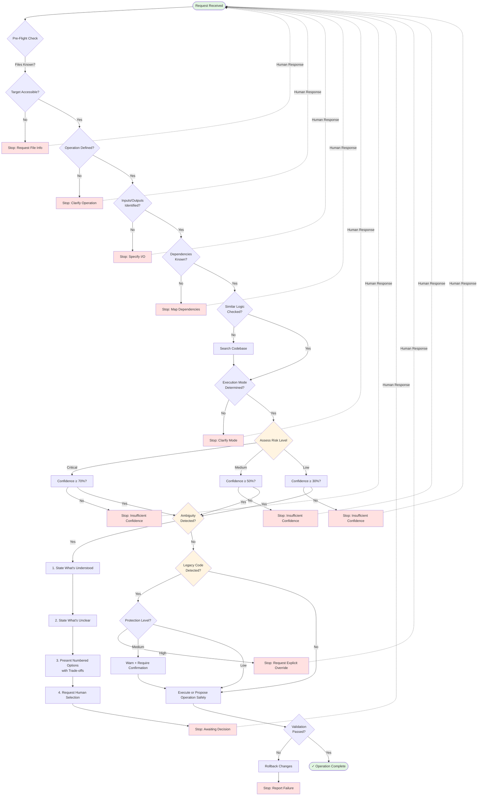

# Zero-Hallucination Protocol - Decision Flow

## Diagram Legend

- **Green nodes**: Start and successful completion
- **Red nodes**: Stop conditions requiring human input
- **Yellow nodes**: Decision points with uncertainty checks
- **Dotted lines**: Feedback loop after human response

## Key Decision Points

1. **Pre-Flight Check**: Validates all prerequisites before any code generation
2. **Confidence Threshold**: Matches risk level to required confidence percentage
3. **Ambiguity Detection**: Forces explicit clarification when multiple valid paths exist
4. **Legacy Protection**: Prevents unintended changes to critical existing code. High protection always requires explicit human authorization.
The agent cannot downgrade protection levels on its own.
5. **Validation**: Ensures changes meet quality standards before committing

## Stop Conditions

The system stops and requests human input when:
- Required information is missing
- Confidence falls below threshold for operation risk level
- Ambiguity cannot be resolved automatically
- Legacy code protection is triggered
- Post-execution validation fails
